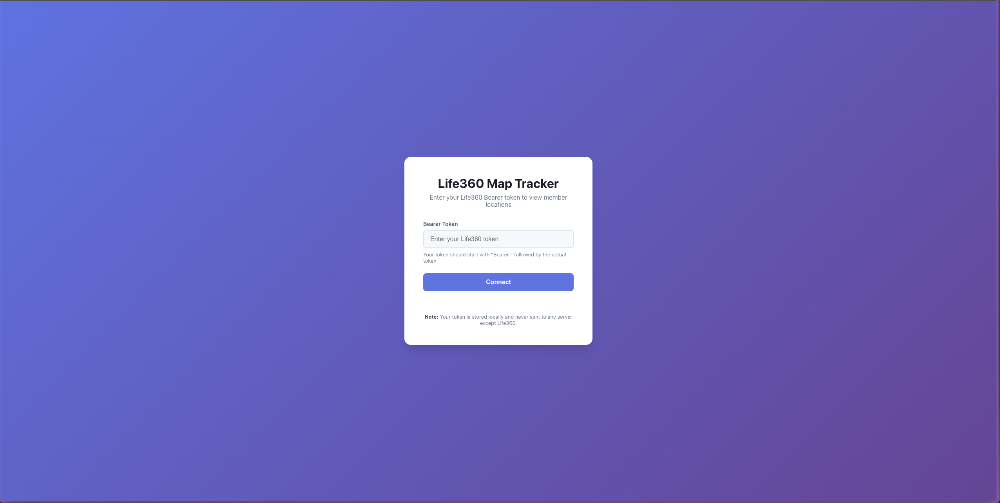

# Life360 Web UI

A monorepo that provides a web-based interface to track and visualize Life360 circles. This project consists of two main components:

* **Backend**: A FastAPI service that interfaces with the unofficial Life360 API and exposes RESTful endpoints.
* **Frontend**: A React + Vite TypeScript application that displays member locations on an interactive map using Leaflet.

---

## 🎨 Screenshots

### Login Screen



### Map View


### API Routes


---

## 📂 Repository Structure

```
Life360-Web-UI/
├── backend/              # FastAPI application
│   ├── README.md         # Backend-specific setup & usage
│   ├── .gitignore
│   └── ...
├── frontend/             # React TypeScript application
│   ├── README.md         # Frontend-specific setup & usage
│   ├── .gitignore
│   └── ...
├── .gitignore            # Root-level ignores
└── README.md             # This master README
```

---

## 🚀 Getting Started

To get up and running, choose one of the following workflows:

### 1. Full Local Development

1. **Clone the repository**

   ```bash
   git clone https://github.com/andrewcincotta/Life360-Web-UI.git
   cd Life360-Web-UI
   ```
2. **Backend Setup**

   * See [backend/README.md](backend/README.md) for detailed instructions.
3. **Frontend Setup**

   * See [frontend/README.md](frontend/README.md) for detailed instructions.

### 2. Dockerized Build (Coming Soon)

We are working on a Docker-based initialization and build process to simplify setup. Stay tuned!

---

## 🔍 Features

| Component                                                            | Highlights                           |
| -------------------------------------------------------------------- | ------------------------------------ |
| **Backend**                                                          | • Token-based Life360 authentication |
| • Retrieve circles, members, and user info via HTTP endpoints        |                                      |
| • Interactive API docs (Swagger & ReDoc)                             |                                      |
| **Frontend**                                                         | • Secure token storage               |
| • Map display with custom markers (avatars, battery, driving status) |                                      |
| • Circle selector and realtime refresh                               |                                      |
| • Light/dark/satellite map modes                                     |                                      |

---

## 🎨 Screenshots

### Login Screen


### Map View


---

## 📖 Detailed Documentation

* **Backend**: [backend/README.md](backend/README.md)
* **Frontend**: [frontend/README.md](frontend/README.md)

For API reference, visit the running service at:

* Swagger UI: `http://localhost:8000/docs`
* ReDoc: `http://localhost:8000/redoc`

---

## 🛠️ Development Workflow

1. Create feature branches off `main`.
2. Follow coding standards and add tests where applicable.
3. Submit pull requests for review.
4. Ensure CI checks pass before merging.

---

## 📜 License

This project is licensed under the MIT License. See [LICENSE](LICENSE) for details.

---

*Happy tracking!*
