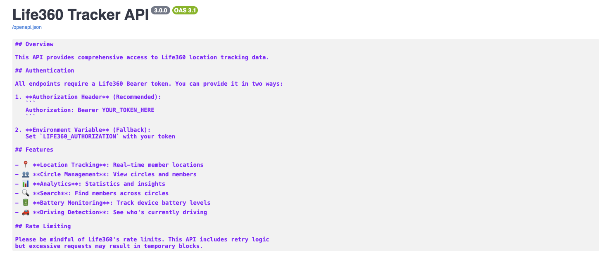
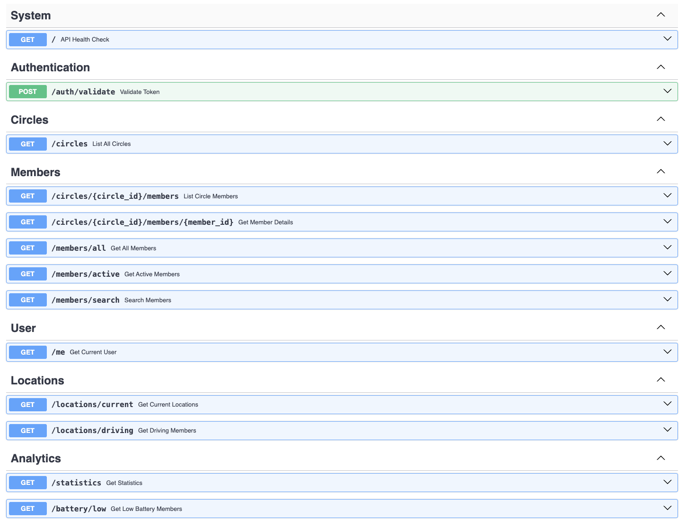

# Life360 FastAPI Implementation

A minimal FastAPI app that exposes the Life360 API as a RESTful service. Easily retrieve your circles, members, and user info using simple HTTP endpoints.




---

## 🚀 Quickstart

### 1. Create a Virtual Environment + Install Requirements
```bash
# Make sure to do this in the correct directory!
# Failure to do so will break life360 package import
cd backend
python3 -m venv .venv
source .venv/bin/activate
pip install -r requirements.txt
```

### 2. Run the App
```bash
python3 -B run.py
```

The API will be available at [http://localhost:8000](http://localhost:8000)

---

## 🔑 Access Token Instructions

To use this API, you need a Life360 access token. The easiest way to get one is:

1. Go to [life360.com/login](https://life360.com/login) and log in.
2. Open your browser's Developer Tools and go to the Network tab.
3. Log in and look for a network request named `token` (POST method, not preflight/OPTIONS).
4. In the response, find `token_type` (usually "Bearer") and `access_token`.
5. Use these values for authentication in this app.

*Note: Life360's SMS login flow is not supported by this method. Any value can be used for the "Account identifier" if prompted.*

---

## 📖 API Documentation

Interactive docs (with pydantic type hinting and example schemas) are available at:
- Swagger UI: [http://localhost:8000/docs](http://localhost:8000/docs)
- ReDoc: [http://localhost:8000/redoc](http://localhost:8000/redoc)